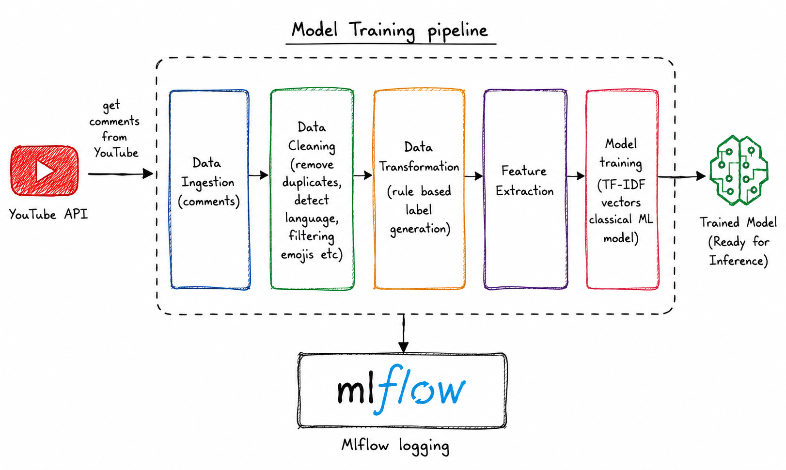
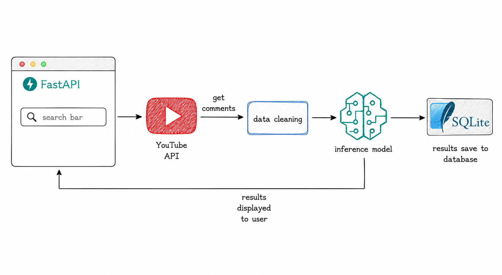
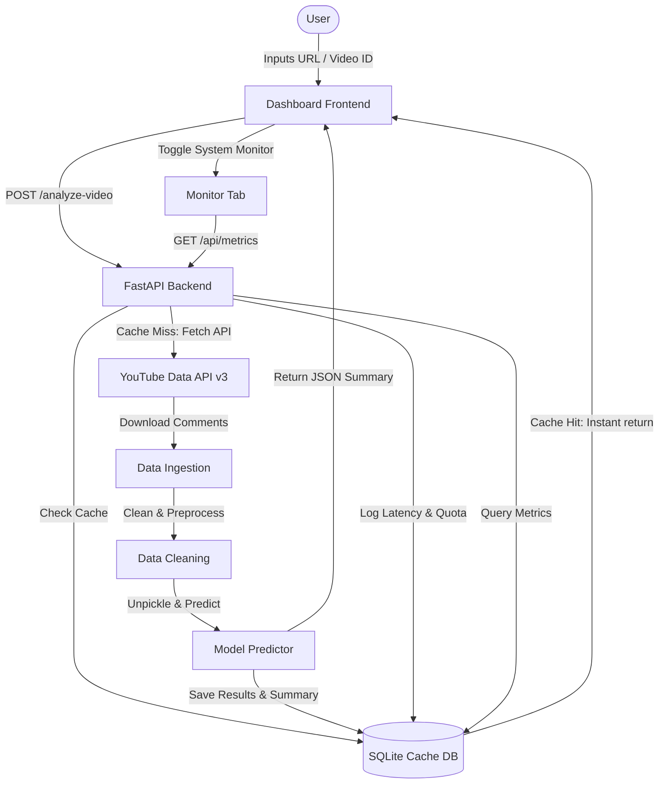

# YouTube Comment Sentiment Classifier & MLOps Dashboard

A production-grade, serverless-optimized MLOps application that performs real-time sentiment analysis on YouTube comment threads. This project demonstrates full-stack software engineering and machine learning deployment best practices, featuring an interactive live dashboard, caching layer, and a real-time system performance monitor.

**[Live Project Dashboard](https://youtube-sentiment-classifier.vercel.app/)**

> [!NOTE]
> This project is designed as a demonstration of **traditional machine learning** implementation and **MLOps** engineering pipelines (TF-IDF vectorization, scikit-learn classifiers, custom caching, and experiment tracking). For pure production-grade accuracy, utilizing commercial Large Language Models (LLMs) or fine-tuning pre-trained transformer models (such as BERT or RoBERTa) would yield superior classification results.

---

## Key Features

* **Real-time Comment Ingestion & Cleaning**: Connects to the YouTube Data API v3 to fetch comments, cleans symbols, and filters out non-English text in real-time.
* **Custom Machine Learning Classifier**: Employs a TF-IDF Vectorizer and a balanced Logistic Regression model to classify comment sentiments into Positive, Neutral, or Negative.
* **Serverless SQLite Caching Layer**: Utilizes an automated caching mechanism to cache video details and analysis summaries. If a video is queried again, the results load instantly, saving network latency and YouTube API quota units.
* **System Monitoring Dashboard**: Exposes live runtime performance statistics, including:
  * Total requests processed.
  * Average endpoint latencies.
  * YouTube Data API quota consumption tracking (estimated quota units consumed).
  * API success/error rates.
  * Global sentiment mix across all cached analyses.
  * Active ML model hyperparameters (TF-IDF features size, regularization strength, class weights).
* **MLops & Experiment Tracking**: Uses **MLflow** and **DagsHub** for model training pipeline logging, metric runs, and artifact tracking. You can view all tracked experiments publicly at the [DagsHub MLflow Workspace](https://dagshub.com/aditya0589/youtube-sentiment-classifier.mlflow).

---

## Technology Stack

* **Backend**: Python, FastAPI, Pydantic, SQLite (SQLite3), scikit-learn, NLTK (VADER), pandas, numpy
* **Frontend**: Vanilla HTML5, CSS3 (Glassmorphism layout), JavaScript (ES6+), Chart.js
* **MLOps / Deployment**: MLflow, DagsHub ([Public Workspace](https://dagshub.com/aditya0589/youtube-sentiment-classifier.mlflow)), GitHub Actions (CI/CD), Vercel (Serverless-optimized deployment)

---

## System Architecture

### 1. Offline Model Training Pipeline
The training pipeline ingests historical channel comments, preprocesses and structures the text, applies rule-based sentiment labels via NLTK (VADER), and fits a scikit-learn classifier model with MLflow experiment tracking.



### 2. Live Inference & Caching Pipeline
The live application runs in-memory text predictions, checking the local SQLite database cache first to bypass duplicate YouTube API network calls and conserve data quota before rendering real-time dashboard analytics.



<details>
<summary><b>Code-level Data Flow (Mermaid Diagram)</b></summary>



</details>

---


## Environment Variables

To run the application, create a `.env` file in the root directory:

```env
YT_API_KEY=your_youtube_api_key
MLFLOW_TRACKING_URI=https://dagshub.com/aditya0589/youtube-sentiment-classifier.mlflow # Public DagsHub MLflow tracking URI
```

---

## Local Setup & Execution

### 1. Clone the repository
```bash
git clone https://github.com/aditya0589/youtube-sentiment-classifier.git
cd youtube-sentiment-classifier
```

### 2. Set up virtual environment
```bash
python -m venv venv
# On Windows
venv\Scripts\activate
# On macOS/Linux
source venv/bin/activate
```

### 3. Install dependencies
* For running the **production/inference API** locally:
  ```bash
  pip install -r requirements.txt
  ```
* For running **offline training pipelines** or Jupyter notebooks:
  ```bash
  pip install -r requirements_local.txt
  ```

### 4. Run the application
```bash
uvicorn app:app --port 8000 --reload
```
Open [http://127.0.0.1:8000](http://127.0.0.1:8000) in your web browser.

---

## API Endpoints

* `GET /`: Serves the HTML frontend dashboard.
* `POST /analyze-video`: Ingests comments for a video, runs sentiment classification, saves the output to the database cache, and returns JSON statistics.
* `POST /predict`: Predicts the sentiment of a single input sentence.
* `POST /retrain`: Triggers the training pipeline on target channels and reloads the model in-memory.
* `GET /api/history`: Retrieves a list of recently analyzed videos.
* `GET /api/history/{video_id}`: Retrieves cached sentiment details and comments for a specific video.
* `GET /api/metrics`: Retrieves aggregated metrics (response latencies, total requests, estimated YouTube API quota consumption).
* `GET /api/model-info`: Retrieves metadata about the loaded Logistic Regression classifier.